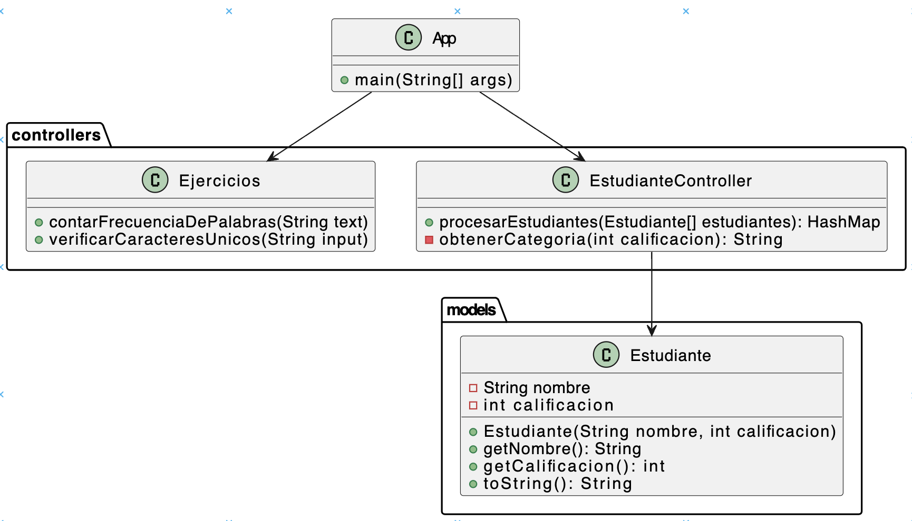

# Instrucciones EXAMEN FINAL

## Diagrama de clases



### Ejercicio 1 
Ordenar Estudiantes y Agrupar por Notas
Enunciado:
Escribe un programa que primero ordene una lista de estudiantes por su calificación usando el método de ordenamiento de tu elección (por ejemplo, QuickSort o MergeSort, etc). Luego, agrupa a los estudiantes en diferentes categorías según su calificación (por ejemplo, A, B, C, etc.) usando un HashMap. 

Cada categoría será una clave en el mapa, y el valor será una lista de estudiantes en esa categoría.

Cagorias:
```java
 if (calificacion >= 90) {
            return "A";
        } else if (calificacion >= 80) {
            return "B";
        } else if (calificacion >= 70) {
            return "C";
        } else if (calificacion >= 60) {
            return "D";
        } else {
            return "F";
        }
```

Desde el main se madr el listado de Estudiantes

Ejemplo de entrada 
```
Juan 85
María 92
Pedro 78
Ana 88
Luis 75
```
Ejemplo de Salida:

```
Estudiantes ordenados por calificación:
Luis: 75
Pedro: 78
Juan: 85
Ana: 88
María: 92

Agrupación por categorías:
A: [María, Ana, Juan]
B: [Pedro, Luis]
```


### Ejercicio 2

#### Contar Frecuencia de Palabras
Enunciado:
Escribe un programa que lea un texto y cuente la frecuencia de cada palabra en el texto. Usa un HashMap para almacenar las palabras y sus frecuencias.

Ejemplo de Entrada:
```
Esta es una prueba. Esta prueba es solo una prueba.
```
Ejemplo de Salida:
```
Frecuencia de palabras:
esta: 2
es: 2
una: 2
prueba.: 2
solo: 1
```

#### Determinar si una Cadena Tiene Caracteres Únicos
Enunciado:
Escribe un programa que determine si una cadena tiene todos los caracteres únicos. Usa un HashSet para verificar la unicidad de los caracteres.


Ejemplo de Entrada:

```
abcdefg
```
Ejemplo de Salida:
```
La cadena tiene todos los caracteres únicos.
```

Ejemplo de Entrada:

```
hello
```
Ejemplo de Salida:

```
La cadena no tiene todos los caracteres únicos.
```